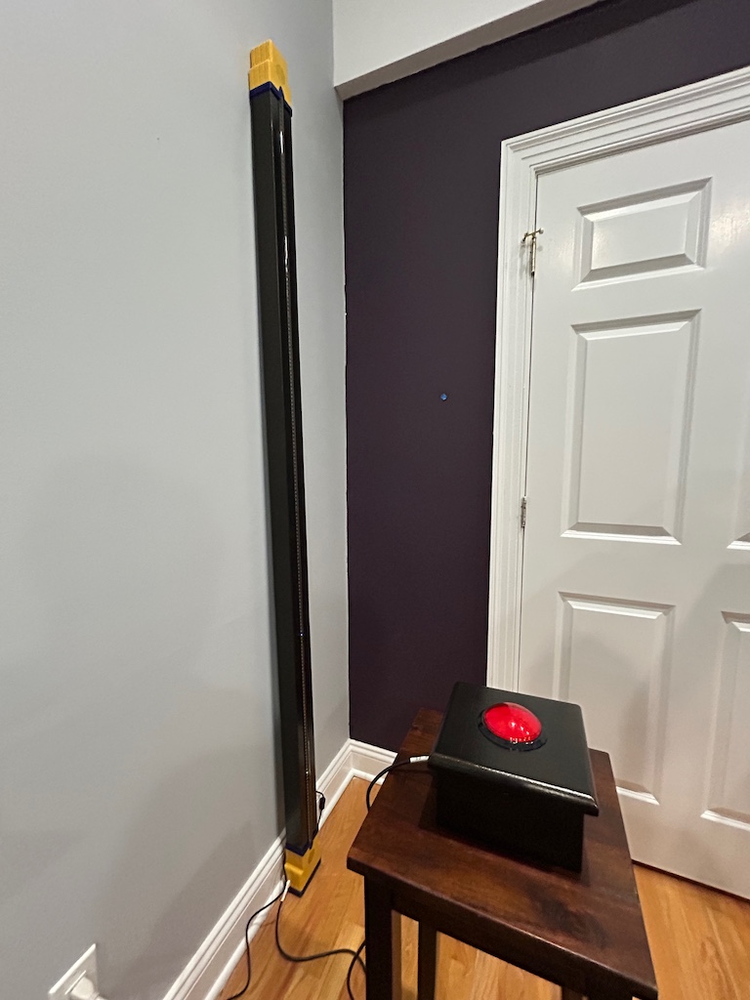

@
[TOC]

# Birthday Tower

The Birthday Tower is an interactive toy with light and sound,
intended for young children.

It is a 2.2 meter tall wooden tower with 3D printed top and base.
It has a strip of LEDs running its length, and it has one big red
illuminated arcade button in a separate controller box.

It's called Birthday Tower because it will be a gift for two 
family members who're about to celebrate their
fifth and third birthdays. (Summer 2024)

# Hardware

The electronics are:

 * Teensy 4.0
 * Teensy Audio Adapter
 * Adafruit NeoPXL8 Friend
 * 2 meters of 100/meter WS2812 RGB LEDs
 * a 5 volt, 10 amp power brick (Adafruit)
 * 2 Adafruit 40mm speakers
 * Adafruit 100mm arcade button, red
 * a bunch of wiring and connectors

The 3D printed parts are not published.  Ask if you're serious about building one.

# Repository Organization

### Audio\_Graph

  script to process Teensy Audio Library module graphs

### BT\_Teensy

  the birthday tower firmware running on the Teensy

### Electric\_Finger

  unfinished (barely started) sketch to generate
  interesting sequences of button presses

### Electric\_Finger\_Random

  sketch that presses the button with random timing and duration.
  Runs on any 3.3 volt Arduino-like; I used a Teensy 3.2.  (Don't use
  5V.  5V will kill the Teensy in the tower.)
   
### Interactive\_Diversion\_1

  the original 2013 project that inspired this.
  It ran on an Arduino Uno.

### Ping\_Pong

  an audio test sketch that demonstrates a ping-pong
  delay

### Reverb\_Sketch

  an unfinished sketch that uses Mutable Instruments modules

### Reverb\_Test

  a test sketch that implements the Mutable Instruments
  modules and the parameter real-time tuning system.  I used
  it to tune the sounds of the bass drum, FM drum, and reverb
  modules.

### Tweaker

  the GUI tool that edits audio parameters in real time
  for Reverb\_Test and (soon) BT\_Teensy

### wav2sketch

  Paul Stoffregen's tool to convert .WAV files into C++ sources files
  in the format used by the playMem audio module.

# License

My code is licensed under the GPL 3.0.  Emilie Gillet's code (Mutable
Instruments) is released under the three clause MIT license.
